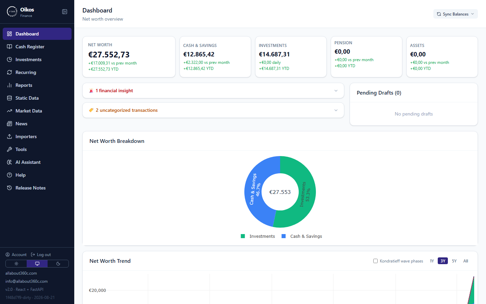
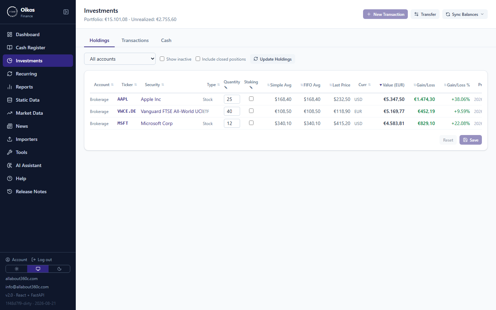
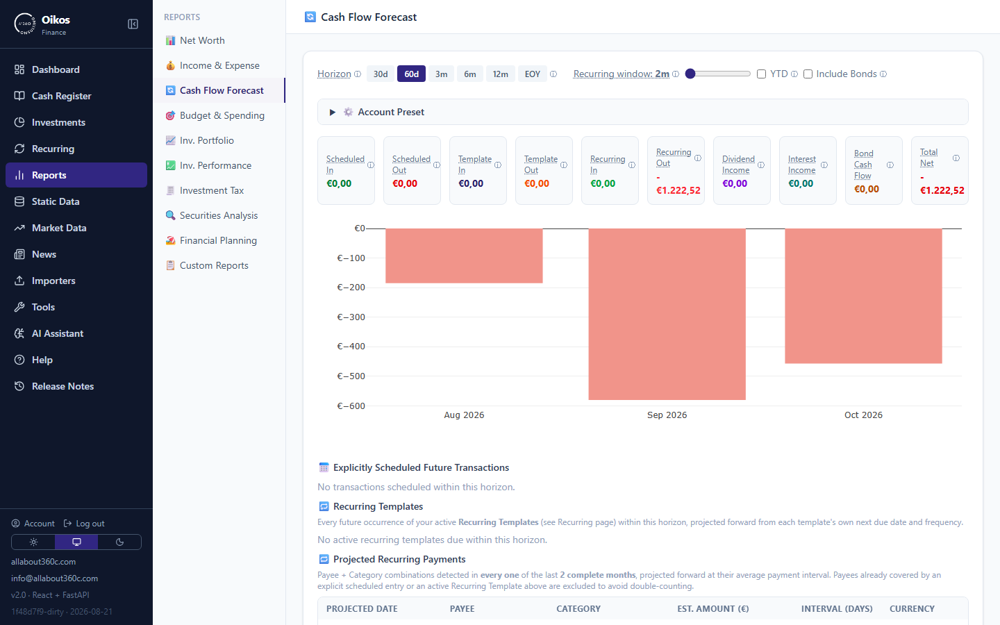
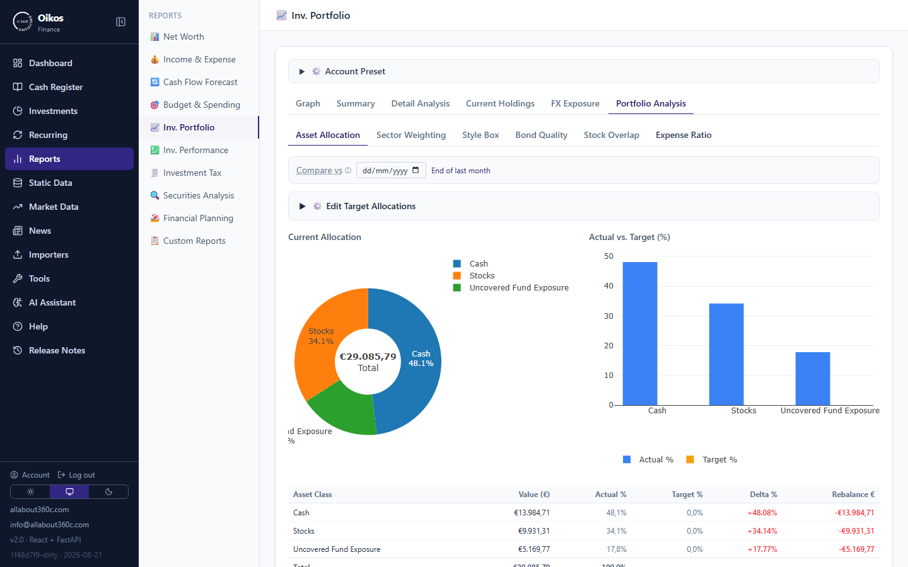

# Oikos

*A development of [ALL ABOUT 360 CONSULTING](https://github.com/atsob).*

A personal finance app — bank & cash accounts, transactions, and multicurrency
investments (stocks, ETFs, bonds, crypto) with cash flow forecasting, tax
reporting, and portfolio analysis. FastAPI + React/TypeScript, backed by
PostgreSQL. (An earlier Streamlit version has since been fully rebuilt on this
stack.)

Self-hosted, single-tenant by design — everything below sets up one instance
for one household. For the full walkthrough (PostgreSQL setup, the TLS
certificate step, every `.env` variable, backups, troubleshooting), see
[INSTALL.md](./INSTALL.md) — this page is just the fast path.

## Screenshots

*(All figures below are from a seeded demo instance — fabricated data, not a
real household's finances.)*

| | |
|---|---|
|  |  |
| Dashboard — net worth breakdown and trend | Investments — holdings with live gain/loss |
|  |  |
| Cash Flow Forecast — projected balance over a chosen horizon | Portfolio X-Ray — look-through asset allocation vs. target |

## Prerequisites

- **PostgreSQL** (with the [pgvector](https://github.com/pgvector/pgvector)
  extension installed and available) — reachable from wherever the app
  containers run. Install it on the host yourself (see
  [INSTALL.md § PostgreSQL setup](./INSTALL.md#1-postgresql-setup)), or skip
  that and run `docker compose --profile full up -d --build` instead to let
  Compose containerize it for you.
- **Docker** + **Docker Compose**.
- A Linux host — `docker-compose.yml` uses `network_mode: host` throughout, so
  Postgres (and optionally [Ollama](https://ollama.com), if you use the
  Ollama-backed AI features — see [INSTALL.md §
  1b](./INSTALL.md#1b-ollama-setup-optional)) are assumed reachable at
  `localhost`. Docker Desktop on Mac/Windows doesn't support host networking
  the same way; see the comment at the top of `docker-compose.yml` for the
  bridge-network alternative if that's your setup.

## Quick start

```bash
git clone https://github.com/atsob/Oikos.git
cd Oikos
cp .env.example .env
# edit .env: at minimum set DB_PASSWORD (to your Postgres password) and
# ADMIN_USERNAME/ADMIN_PASSWORD (your first login — see below)
docker compose up -d --build
```

`docker-compose.yml` also expects a TLS certificate at `./ssl/{cert,key,rootCA}.pem`
that isn't generated automatically — see [INSTALL.md § Generate a TLS
certificate](./INSTALL.md#3-generate-a-tls-certificate) for the one-time
`openssl` commands before your first `up`.

The schema is created automatically on first startup — no manual `psql` step.
Point `docker compose up` at any empty Postgres database and it self-initializes,
seeded with generic starter data (currencies, well-known US stocks/ETFs, major
international institutions, a standard expense/income category list, common
payees, and Greek-resident tax rules) so Static Data isn't empty on day one.

Open `https://<host>:8443` and log in with the `ADMIN_USERNAME`/`ADMIN_PASSWORD`
from `.env` (only used once, to create that first account — safe to leave set
afterward). The self-signed cert's CA is downloadable from
`http://<host>:8444/ca.crt` if you want your browser/OS to trust it directly.
Add more accounts, or change your password, from the sidebar's **Account** panel
once logged in.

See `.env.example` for every other optional integration (market data, open
banking imports, local LLM) — all are optional and the app runs fine without
them; unset ones just show up empty or need entering manually in the relevant
import tab.

## Updating

```bash
git pull
docker compose up -d --build
```

Startup migrations (schema changes since your last update) run automatically
and are idempotent — safe to run on every restart.

## What's new

See [CHANGELOG.md](./CHANGELOG.md), also browsable in-app under **Release Notes**.

## Support

Oikos is free and open source. If it's useful to you, consider
[sponsoring its development on GitHub](https://github.com/sponsors/atsob) —
every bit helps keep it maintained.

## License

Copyright © 2026 All About 360 Consulting.

GNU AGPLv3 — see [LICENSE](./LICENSE). In short: you're free to self-host,
modify, and share Oikos under those terms, but if you run a modified version
as a network service for others, the AGPL requires you to make that
modified source available to those users too.

Want to use Oikos somewhere the AGPL's terms don't fit — embedding it in a
closed-source product, or offering it as a hosted service without the
source-disclosure obligation — a separate commercial license is available;
[open an issue](https://github.com/atsob/Oikos/issues) or contact the
maintainer directly.
